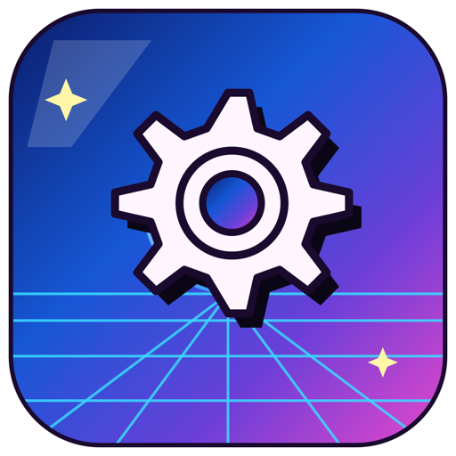

# Teleport Connect Native

A native macOS (SwiftUI) rewrite of [Teleport Connect](https://goteleport.com/docs/connect-your-client/teleport-connect/) — Teleport's official Electron desktop client. This is an unofficial, locally-built project: **not affiliated with, endorsed by, or supported by Gravitational/Teleport.**

Teleport Connect's Electron app is a thin UI layer over `tshd`, a Go daemon that does all the actual work (auth, SSH, DB/Kube/App proxying) and exposes it over a local gRPC service. This project keeps that daemon completely untouched — it's the same `tsh` binary you'd install via `brew install teleport` — and replaces only the Electron/React frontend with a native AppKit/SwiftUI one talking to it over the same gRPC pipe.

<p align="center"></p>

## What it does

- Spawns `tsh daemon start` and connects over a Unix domain socket with `grpc-swift` — no TLS needed, same as Electron does on macOS.
- Lists your `tsh` profiles/clusters and lets you switch between them, log in, and log out.
  - SSO providers open an **in-app WebView** for the sign-in flow (instead of handing off to the system browser), with an "Open in Browser" escape hatch for providers that need real WebAuthn/passkey entitlements or Web Bluetooth (neither of which an embedded/ad-hoc-signed WKWebView can do).
  - Local (username/password) and passwordless/WebAuthn login both work natively, including
    per-session MFA (a Touch ID/security key tap, or a TOTP code) via a small gRPC server this
    app runs itself — `TshdEventsService`, which tshd calls *into* mid-login when it needs
    something a plain request/response can't provide.
  - Browser handoff for MFA: the "Verify it's you" screen opens the cluster's browser-MFA page so a
    browser/iCloud passkey can answer (tshd itself can only use USB security keys or Touch ID
    credentials registered with tsh). Preferences > "Login with tsh" stores a login name and
    `--mfa-mode`, and the login form's "Log in with tsh" button runs `tsh login --mfa-mode=…` in a
    terminal tab. Passwordless login still needs a security key or a tsh-registered Touch ID
    credential ("..." menu > Register Touch ID Passkey).
  - Saved local-login credentials are pre-filled from the Keychain next time you log in to the
    same cluster.
- Browses cluster resources (servers, databases, Kubernetes clusters, apps, Windows desktops) as a grid or list, with type filtering, search-as-you-sort, pinning, and a resource count in the status bar.
  - **Health status filtering** for databases/Kubernetes clusters: filter by healthy/unhealthy/unknown, and unhealthy resources get a warning badge with a popover showing the status/message/error tshd reported.
- Opens a **real embedded terminal** for SSH sessions and local shells — [SwiftTerm](https://github.com/migueldeicaza/SwiftTerm) allocates an actual PTY and runs `tsh ssh ...` attached to it, the same approach Electron's `node-pty` takes.
- Resolves real per-resource/app icons: ported the actual `guessAppIcon` matching heuristic from Teleport's own web UI, plus ~400 bundled brand SVGs from Teleport's design system, extended with icons for self-hosted homelab apps (Sonarr, Radarr, Home Assistant, etc., from [selfhst/icons](https://github.com/selfhst/icons)) — and a **custom icon picker** (right-click any resource) for anything not already covered.
- Native macOS look: system window/control colors instead of a hardcoded palette, with a light/dark/system theme toggle in the top bar.
- A Preferences window (⌘,) covering `app_config.json` settings (theme, terminal font, SSH agent behavior, etc. — same schema/keys as Electron Connect's config file) plus a system-browser choice (Safari/Chrome) for SSO handoff.
- Ships as a real, launchable `.app` with its own icon — see [Packaging](#packaging).

## What it doesn't do (yet)

Access requests, VNet, Connect My Computer, and file transfer are visible in the UI (toolbar filters, top-bar icon) but not wired up — they show an explanatory popover instead of silently doing nothing. DB/Kube/App gateway proxying (as opposed to browsing) isn't implemented.

## Why this was even feasible

A few things made "just the UI, keep the engine" realistic instead of a rebuild-everything project:

- **No mTLS to reimplement.** On macOS, tshd listens on a plaintext Unix domain socket — the Electron app only uses mTLS on Windows (named pipes). A Swift client just opens a UDS channel.
- **SSH sessions aren't a gRPC stream.** Electron just spawns `tsh ssh user@host` as a child process under a PTY. tshd's gRPC API has no terminal-I/O RPCs at all.
- **DB/Kube/App gateways are TCP, not gRPC.** `CreateGateway` just makes tshd open a local TCP listener; your own `psql`/`kubectl` connects to it directly. gRPC is control-plane only (start/stop/rename).

## Building

Requires macOS 15+ and Swift 6 (Xcode **not** required — this was built with only the Command Line Tools installed).

```bash
swift build -c release --product TeleportConnectNative
```

or run it directly without packaging:

```bash
swift run TeleportConnectNative
```

## Packaging as a real `.app`

```bash
./Packaging/build-app.sh
open "dist/Teleport Connect Native.app"
```

The script builds the release binary, regenerates `AppIcon.icns` from `AppIconSource/icon-preview.svg` (via `qlmanage`/`sips`/`iconutil` — all ship with the base OS), assembles the bundle, and ad-hoc code-signs it (required to run at all on Apple Silicon).

## Architecture

```
Sources/
  TshdProto/    generated gRPC/protobuf Swift code for tshd's TerminalService, VnetService, AutoUpdateService
  TshdKit/      TshdProcess (spawns/monitors tshd) + TshdClient (gRPC calls, incl. streaming passwordless login)
  TeleportConnectNative/
    AppModel.swift            central @Observable state — clusters, resources, tabs, login flow
    AppConfig.swift           app_config.json schema (mirrors Electron's appConfigSchema.ts)
    CustomIconStore.swift     persists user-uploaded custom resource icons
    KeychainCredentialStore.swift  saves/prefills local-login credentials via the Keychain
    TshdEventsServer.swift    the server side of TshdEventsService — handles tshd's MFA/
                              hardware-key/relogin callbacks (see "What it does" above)
    GuessAppIcon.swift       ported icon-matching heuristic from shared/components/UnifiedResources
    ResourceIconSpecs*.swift generated + hand-maintained icon name -> SVG/PNG filename tables
    Views/                   TopBar, TabStrip, ResourceList/Card/List, LoginSheet, SSOBrowser,
                              Settings, TerminalHost, StatusBar, NativeCredentialFieldsView
                              (real AppKit text fields for Password AutoFill's key-icon UI)
    Resources/ResourceIcons/  ~400 bundled brand SVGs
```

Proto files and the icon/theme source data were pulled from a sparse checkout of [gravitational/teleport](https://github.com/gravitational/teleport) (for exact parity with the real app's layout, color tokens, and behavior) and are not included here — only the generated/derived Swift code and the icon assets actually used are.

## Notable implementation quirks

- **`@State`/`@Binding` don't compile without Xcode.app.** This SDK's SwiftUI backs those with a macro plugin (`SwiftUIMacros`) that ships only inside Xcode, not the Command Line Tools. All view-local UI state lives on `AppModel` (`@Observable`, backed by the open-source `ObservationMacros` plugin) instead, with manual `Binding(get:set:)` where a library API needed one.
- **SwiftTerm is pinned to 1.10.0.** 1.15.0+ added a `.metal` shader that Package.swift processes unconditionally, which needs Xcode's Metal compiler.
- **App activation is forced explicitly.** Launched via a raw `swift build` binary (no Finder/LaunchServices), the app's window still takes mouse clicks fine but never becomes the frontmost app on its own — global shortcuts like ⌘T would silently go to whichever app was already frontmost without `NSApp.activate(ignoringOtherApps: true)` in `applicationDidFinishLaunching`.
- **Icons matter more than you'd think.** Several `selfhst/icons` "-dark"/"-light" variants are bare colorless SVG paths (no `fill` at all) rather than themed color variants — the plain filename is consistently the real full-color logo. AppKit's `NSImage` also sometimes infers `isTemplate` for vector images, which forces flat monochrome tinted rendering; explicitly setting `isTemplate = false` after loading fixed it.

## License / attribution

This repo contains original code plus derived/ported logic (icon-matching heuristics, layout structure, color tokens) studied from Teleport Connect's source, which is [AGPL-3.0](https://github.com/gravitational/teleport/blob/master/LICENSE). Bundled icon assets: ~400 from Teleport's own `@gravitational/design-system`, a handful from [selfhst/icons](https://github.com/selfhst/icons) (CC-BY-4.0), and one original icon (`poe-bounce.svg`) drawn for this project.
